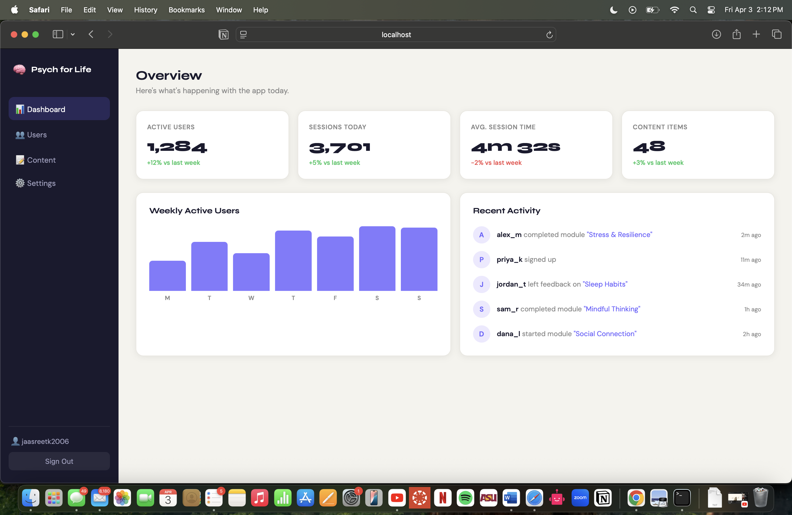

# Psych for Life — Dashboard



> An admin dashboard and CMS built with React + TypeScript,
> simulating the analytics and content management layer
> for a psychology wellness app.
A web dashboard built with **React + TypeScript** to simulate an admin interface for a psychology app. Includes user authentication flow, analytics stats, a weekly activity chart, and a live activity feed.

## Tech Stack

- React 18
- TypeScript
- Vite (build tool)
- CSS (no external UI libraries)

## Features

- **Login Page** — form with validation, mimics an auth flow (similar to AWS Cognito)
- **Analytics Dashboard** — stat cards showing user metrics with positive/negative change indicators
- **Bar Chart** — weekly active users built from scratch with CSS
- **Activity Feed** — recent user actions across the app
- **Sidebar Navigation** — persistent nav with active state

## Getting Started

```bash
# Install dependencies
npm install

# Start dev server
npm run dev
```

Then open [http://localhost:5173](http://localhost:5173) in your browser.

To log in, use any email (e.g. `test@asu.edu`) and any password.

## Project Structure

```
src/
├── App.tsx              # Root component, handles login state
├── App.css              # All styles
└── components/
    ├── Login.tsx        # Login form with validation
    ├── Dashboard.tsx    # Main dashboard layout
    ├── StatCard.tsx     # Reusable stat card component
    └── ActivityFeed.tsx # Recent activity list
```

## What I Learned / Built

- Component-based architecture in React
- TypeScript props and interfaces
- Controlled form inputs with validation
- Conditional rendering (login vs dashboard)
- CSS layout with Flexbox and Grid
- Reusable components with typed props
